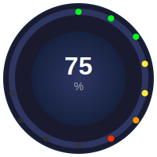

# Custom Gauge Card

[](https://github.com/custom-components/hacs)
[](https://github.com/guiohm79/custom-gauge-card/releases)

Une carte personnalisée pour Home Assistant qui affiche vos capteurs sous forme de jauge circulaire LED animée et interactive.



## Fonctionnalités

✨ **Design Moderne et Animé**
- Jauge circulaire avec LEDs animées
- Transitions fluides et douces entre les valeurs
- Effets d'ombre et de lumière dynamiques
- Thèmes personnalisables (clair, sombre, personnalisé)

🎯 **Zones et Marqueurs**
- Définissez des zones colorées pour visualiser des plages de valeurs
- Ajoutez des marqueurs avec étiquettes pour des repères spécifiques
- Configuration flexible des couleurs et opacités

📊 **Indicateur de Tendance**
- Affichage de l'évolution sur 24 heures
- Pourcentage de changement avec flèche directionnelle
- Historique automatique depuis Home Assistant

🎮 **Contrôle Interactif**
- Contrôlez vos entités directement depuis la jauge
- Interface circulaire intuitive par glisser-déposer
- Compatible avec `input_number` et entités `number`

⚡ **Performances Optimisées**
- Mode économie d'énergie (pause quand invisible)
- Réduction automatique des LEDs sur mobile
- Débouncing des mises à jour
- Animations optimisées

♿ **Accessible**
- Attributs ARIA pour lecteurs d'écran
- Navigation au clavier supportée
- Rôle slider pour contrôles interactifs

## Installation

### Via HACS (Recommandé)

1. Ouvrez HACS dans Home Assistant
2. Allez dans "Frontend"
3. Cliquez sur le menu (⋮) en haut à droite
4. Sélectionnez "Dépôts personnalisés"
5. Ajoutez l'URL : `https://github.com/guiohm79/custom-gauge-card`
6. Sélectionnez la catégorie "Lovelace"
7. Cliquez sur "Installer"
8. Redémarrez Home Assistant

### Installation Manuelle

1. Téléchargez le fichier `custom-gauge-card.js`
2. Copiez-le dans `config/www/custom-gauge-card.js`
3. Ajoutez la ressource dans Home Assistant :
   - Allez dans **Paramètres** → **Tableaux de bord** → **Ressources**
   - Cliquez sur **+ Ajouter une ressource**
   - URL : `/local/custom-gauge-card.js`
   - Type : **Module JavaScript**
4. Redémarrez Home Assistant

## Configuration

### Configuration Minimale

```yaml
type: custom:custom-gauge-card
entity: sensor.temperature
name: Température
unit: "°C"
min: 0
max: 40
```

### Configuration Complète

```yaml
type: custom:custom-gauge-card
entity: sensor.niveaux_cuves_capteur_niveau_cuve_1
name: Niveau cuve 1
unit: L
min: 0
max: 3000

# Apparence
gauge_size: 220
center_size: 120
led_size: 7
leds_count: 150
decimals: 0

# Thème
theme: dark  # default, light, dark, custom
custom_background: "#2c2c2c"
custom_gauge_background: "radial-gradient(circle, #444, #222)"
custom_center_background: "radial-gradient(circle, #333, #111)"
custom_text_color: "#ffffff"
custom_secondary_text_color: "#aaaaaa"

# Animations
smooth_transitions: true
animation_duration: 800

# Effets visuels
enable_shadow: true
center_shadow: true
center_shadow_blur: 30
center_shadow_spread: 5

# Tendance
show_trend: true

# Marqueurs
markers:
  - value: 1000
    color: "#ffffff"
    label: 1/3
  - value: 2000
    color: "#ffff00"
    label: 2/3

# Zones colorées
zones:
  - from: 0
    to: 750
    color: "#ff2d00"
    opacity: 0.3
  - from: 750
    to: 1500
    color: "#fb8804"
    opacity: 0.3
  - from: 1500
    to: 3000
    color: "#04fb1d"
    opacity: 0.3

# Couleurs selon sévérité (pour les LEDs)
severity:
  - color: "#ff2d00"
    value: 25
  - color: "#fb8804"
    value: 50
  - color: "#04fb1d"
    value: 100

# Contrôle interactif
enable_control: true
controlable_entity: input_number.cuve_1_niveau_cible

# Optimisations
power_save_mode: true
power_save_threshold: 20
update_interval: 1000
debounce_updates: true
optimize_leds: true
```

## Options de Configuration

### Options de Base

| Option | Type | Défaut | Description |
|--------|------|--------|-------------|
| `entity` | string | **Requis** | Entité à afficher |
| `name` | string | - | Nom affiché sous la jauge |
| `unit` | string | - | Unité de mesure |
| `min` | number | 0 | Valeur minimale |
| `max` | number | 100 | Valeur maximale |
| `decimals` | number | 0 | Nombre de décimales |

### Apparence

| Option | Type | Défaut | Description |
|--------|------|--------|-------------|
| `gauge_size` | number | 200 | Taille de la jauge en pixels |
| `center_size` | number | 120 | Taille du centre en pixels |
| `led_size` | number | 8 | Taille des LEDs en pixels |
| `leds_count` | number | 100 | Nombre de LEDs |

### Thèmes

| Option | Type | Défaut | Description |
|--------|------|--------|-------------|
| `theme` | string | `default` | Thème : `default`, `light`, `dark`, `custom` |
| `custom_background` | string | - | Couleur de fond (thème custom) |
| `custom_gauge_background` | string | - | Fond de la jauge (thème custom) |
| `custom_center_background` | string | - | Fond du centre (thème custom) |
| `custom_text_color` | string | - | Couleur du texte (thème custom) |
| `custom_secondary_text_color` | string | - | Couleur du texte secondaire (thème custom) |

### Animations

| Option | Type | Défaut | Description |
|--------|------|--------|-------------|
| `smooth_transitions` | boolean | true | Activer les transitions fluides |
| `animation_duration` | number | 800 | Durée des animations en ms |

### Effets Visuels

| Option | Type | Défaut | Description |
|--------|------|--------|-------------|
| `enable_shadow` | boolean | false | Activer l'ombre extérieure |
| `center_shadow` | boolean | false | Activer l'ombre au centre |
| `center_shadow_blur` | number | 30 | Flou de l'ombre centrale |
| `center_shadow_spread` | number | 15 | Expansion de l'ombre centrale |

### Fonctionnalités Avancées

| Option | Type | Défaut | Description |
|--------|------|--------|-------------|
| `show_trend` | boolean | false | Afficher l'indicateur de tendance 24h |
| `enable_control` | boolean | false | Activer le contrôle interactif |
| `controlable_entity` | string | - | Entité à contrôler (sinon utilise `entity`) |

### Marqueurs et Zones

| Option | Type | Description |
|--------|------|-------------|
| `markers` | list | Liste de marqueurs avec `value`, `color`, `label` |
| `zones` | list | Liste de zones avec `from`, `to`, `color`, `opacity` |
| `severity` | list | Liste de paliers avec `value`, `color` pour les LEDs |

### Optimisations

| Option | Type | Défaut | Description |
|--------|------|--------|-------------|
| `power_save_mode` | boolean | false | Pause les mises à jour quand invisible |
| `power_save_threshold` | number | 10 | Seuil de visibilité (%) |
| `update_interval` | number | 1000 | Intervalle de mise à jour en ms |
| `debounce_updates` | boolean | false | Limiter la fréquence des mises à jour |
| `optimize_leds` | boolean | false | Réduire LEDs sur mobile |

## Exemples d'Usage

### Jauge de Température

```yaml
type: custom:custom-gauge-card
entity: sensor.temperature_salon
name: Température Salon
unit: "°C"
min: 10
max: 35
severity:
  - color: "#00bfff"
    value: 30
  - color: "#4caf50"
    value: 60
  - color: "#ff9800"
    value: 80
  - color: "#f44336"
    value: 100
```

### Niveau de Batterie

```yaml
type: custom:custom-gauge-card
entity: sensor.phone_battery
name: Batterie Téléphone
unit: "%"
min: 0
max: 100
leds_count: 50
show_trend: true
zones:
  - from: 0
    to: 20
    color: "#f44336"
    opacity: 0.5
  - from: 20
    to: 80
    color: "#4caf50"
    opacity: 0.3
  - from: 80
    to: 100
    color: "#2196f3"
    opacity: 0.3
```

### Consommation Électrique Contrôlable

```yaml
type: custom:custom-gauge-card
entity: sensor.power_consumption
name: Consommation
unit: W
min: 0
max: 5000
enable_control: true
controlable_entity: input_number.power_limit
smooth_transitions: true
animation_duration: 600
markers:
  - value: 2000
    color: "#ffeb3b"
    label: Limite
```

## Compatibilité

- Home Assistant 2024.1.0 ou supérieur
- Tous les navigateurs modernes supportant les Web Components
- Compatible mobile et tablette


## Contribution

Les contributions sont les bienvenues ! N'hésitez pas à :
- Signaler des bugs via les [Issues](https://github.com/guiohm79/custom-gauge-card/issues)
- Proposer des améliorations
- Soumettre des Pull Requests

## Support

Si vous appréciez cette carte, n'hésitez pas à :
- ⭐ Mettre une étoile sur GitHub
- 🐛 Signaler les bugs
- 💡 Proposer de nouvelles fonctionnalités

## Licence

Ce projet est sous licence MIT - voir le fichier LICENSE pour plus de détails.

## Remerciements

Développé avec ❤️ pour la communauté Home Assistant.

---


