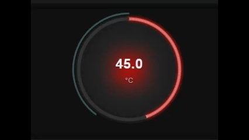
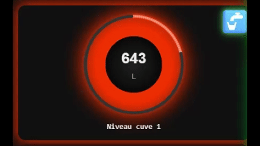
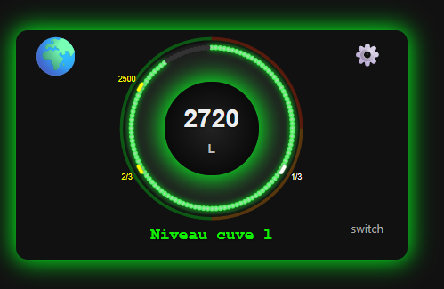
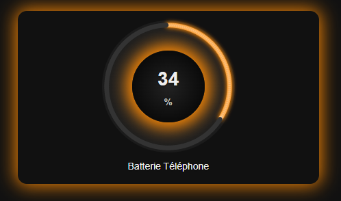
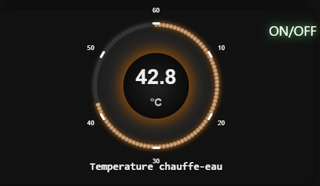
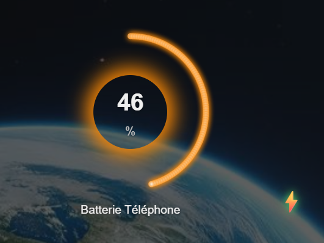
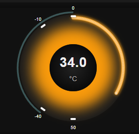
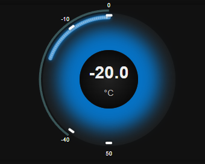

# Custom Gauge Card

[](https://github.com/custom-components/hacs)
[](https://github.com/guiohm79/custom-gauge-card/releases)
[](LICENSE)
[](https://buymeacoffee.com/guiohm79)


A custom card for Home Assistant that displays your sensors as an animated and interactive circular LED gauge.

## 📸 Screenshots

### Animation
<p align="center">
  
  
</p>

### Exemples d'utilisation
<p align="center">
  
  
</p>

<p align="center">
  
  
</p>

<p align="center">
  
  
</p>

<p align="center">
  
</p>


## Features

 **Modern Animated Design**
- Circular gauge with animated LEDs
- Smooth and fluid value transitions
- Dynamic shadow and lighting effects
- **New:** Pulsating center shadow alarm for visual alerts
- **Bidirectional display** for thermometer-style visualization with negative values
- Customizable themes (light, dark, custom)

 **Zones and Markers**
- Define colored zones to visualize value ranges
- Add static markers with labels for specific reference points
- **New:** Dynamic markers that follow entity values in real-time
- Flexible color and opacity configuration
- Full support for bidirectional mode

 **Trend Indicator**
- Display 24-hour evolution
- Percentage change with directional arrow
- Automatic history from Home Assistant

 **Multi-Button Control**
- Control multiple entities directly from the gauge
- Support for switches, lights, scenes, scripts, automations and more
- Up to 4 buttons with customizable positions
- Smart icons and visual feedback

 **Optimized Performance**
- Power save mode (pauses when invisible)
- Update debouncing
- Optimized animations
- Consistent rendering across all devices

 **Accessible**
- ARIA attributes for screen readers
- Keyboard navigation support
- Slider role for interactive controls

## Installation

### Via HACS (Recommended)

[](https://my.home-assistant.io/redirect/hacs_repository/?owner=guiohm79&repository=custom-gauge-card&category=plugin)

1. Open HACS in Home Assistant
2. Go to "Frontend"
3. Click on the menu (⋮) in the top right
4. Select "Custom repositories"
5. Add the URL: `https://github.com/guiohm79/custom-gauge-card`
6. Select category "Lovelace"
7. Click "Install"
8. Restart Home Assistant

### Manual Installation

1. Download the `custom-gauge-card.js` file
2. Copy it to `config/www/custom-gauge-card.js`
3. Add the resource in Home Assistant:
   - Go to **Settings** → **Dashboards** → **Resources**
   - Click **+ Add Resource**
   - URL: `/local/custom-gauge-card.js`
   - Type: **JavaScript Module**
4. Restart Home Assistant

## Configuration

### Minimal Configuration

```yaml
type: custom:custom-gauge-card
entity: sensor.temperature
name: Temperature
unit: "°C"
min: 0
max: 40
```

### Complete Configuration

```yaml
type: custom:custom-gauge-card
entity: sensor.water_tank_level_sensor_1
name: Water Tank 1 Level
unit: L
min: 0
max: 3000

# Appearance
gauge_size: 220
center_size: 120
led_size: 7
leds_count: 150
decimals: 0

# Theme
theme: custom  # default, light, dark, custom
custom_background: "#2c2c2c"
custom_gauge_background: "radial-gradient(circle, #444, #222)"
custom_center_background: "radial-gradient(circle, #333, #111)"
custom_text_color: "#ffffff"
custom_secondary_text_color: "#aaaaaa"

# Title font customization
title_font_family: "Roboto, Arial, sans-serif"
title_font_size: "18px"
title_font_weight: "bold"
# title_font_color: "#00ff00"  # Optional: custom title color

# Animations
smooth_transitions: true
animation_duration: 800

# Visual effects
enable_shadow: true
center_shadow: true
center_shadow_blur: 30
center_shadow_spread: 5

# Pulsating alarm (NEW feature)
center_shadow_pulse: true           # Enable pulsation alarm
center_shadow_pulse_duration: 1500  # Duration of one cycle in ms
center_shadow_pulse_min: 0          # Alarm when value >= 0L (real sensor value)
center_shadow_pulse_max: 750        # Alarm when value <= 750L (real sensor value)
center_shadow_pulse_intensity: 0.3  # Minimum intensity (0.3 = 30% to 100%)

# Trend
show_trend: true

# Static markers (fixed positions)
markers:
  - value: 1000
    color: "#ffffff"
    label: 1/3
  - value: 2000
    color: "#ffff00"
    label: 2/3

# Dynamic markers (follow entity values in real-time)
# IMPORTANT: Entity values must be within the gauge's min/max range (0-3000)
dynamic_markers:
  - entity: sensor.temperature_sensor_1
    color: "#FF5722"      # Optional: custom color (or 'auto' for entity-based color)
    size: 10              # Optional: dot size in pixels (default: 8)
    label: "Temp 1"       # Optional: custom label text
    show_value: true      # Optional: display numeric value (default: false)
  - entity: sensor.temperature_sensor_2
    color: "auto"         # Auto color based on entity domain
    label: "Temp 2"
    show_value: false

# Colored zones
zones:
  - from: 0
    to: 750
    color: "#ff2d00"
    opacity: 0.3
  - from: 750
    to: 1500
    color: "#fb8804"
    opacity: 0.3
  - from: 1500
    to: 3000
    color: "#04fb1d"
    opacity: 0.3

# Severity colors (for LEDs) - uses REAL sensor values (0-3000L)
severity:
  - color: "#ff2d00"    # Red
    value: 750          # Red from 0 to 750L
  - color: "#fb8804"    # Orange
    value: 1500         # Orange from 750 to 1500L
  - color: "#04fb1d"    # Green
    value: 3000         # Green from 1500 to 3000L

# Multi-button control (optional)
button_icon_size: 22  # Default icon size for all buttons (in pixels)
buttons:
  - entity: switch.pump_1
    position: bottom-right
    icon: "●"  # Optional, defaults to entity type icon
    icon_size: 28  # Optional: custom size for this button
  - entity: light.tank_led
    position: top-right
  - entity: script.fill_tank
    position: bottom-left
    icon: "▶"
    icon_size: 20  # Optional: custom size for this button

# Optimizations
power_save_mode: true
power_save_threshold: 20
update_interval: 1000
debounce_updates: true

```

## Configuration Options

### Basic Options

| Option | Type | Default | Description |
|--------|------|---------|-------------|
| `entity` | string | **Required** | Entity to display |
| `name` | string | - | Name displayed below the gauge |
| `unit` | string | - | Unit of measurement |
| `min` | number | 0 | Minimum value |
| `max` | number | 100 | Maximum value |
| `decimals` | number | 0 | Number of decimal places |

### Appearance

| Option | Type | Default | Description |
|--------|------|---------|-------------|
| `gauge_size` | number | 200 | Gauge size in pixels |
| `center_size` | number | 120 | Center size in pixels |
| `led_size` | number | 8 | LED size in pixels |
| `leds_count` | number | 100 | Number of LEDs |
| `bidirectional` | boolean | false | Enable bidirectional display (thermometer-style for negative values) |

### Themes

| Option | Type | Default | Description |
|--------|------|---------|-------------|
| `theme` | string | `default` | Theme: `default`, `light`, `dark`, `custom` |
| `custom_background` | string | - | Background color (custom theme) |
| `custom_gauge_background` | string | - | Gauge background (custom theme) |
| `custom_center_background` | string | - | Center background (custom theme) |
| `custom_text_color` | string | - | Text color (custom theme) |
| `custom_secondary_text_color` | string | - | Secondary text color (custom theme) |

### Title Font Customization

| Option | Type | Default | Description |
|--------|------|---------|-------------|
| `title_font_family` | string | `inherit` | Font family for the title (e.g., "Roboto, Arial, sans-serif") |
| `title_font_size` | string | `16px` | Font size for the title |
| `title_font_weight` | string | `normal` | Font weight for the title (e.g., "normal", "bold", "600") |
| `title_font_color` | string | - | Custom color for the title (overrides theme color) |

**Title Font Examples:**

```yaml
# Modern style
title_font_family: "Roboto, Helvetica, Arial, sans-serif"
title_font_size: "18px"
title_font_weight: "500"

# Elegant style
title_font_family: "Georgia, 'Times New Roman', serif"
title_font_size: "20px"
title_font_weight: "normal"

# Technical/monospace style
title_font_family: "Consolas, 'Courier New', monospace"
title_font_size: "16px"
title_font_weight: "bold"

# Use Home Assistant default font
title_font_family: "inherit"

# Bold with custom color
title_font_family: "Arial, sans-serif"
title_font_size: "22px"
title_font_weight: "bold"
title_font_color: "#00ff00"
```

### Center Value and Unit Font Customization

#### Center Value Options

| Option | Type | Default | Description |
|--------|------|---------|-------------|
| `value_font_family` | string | `inherit` | Font family for the center value (e.g., "Roboto, Arial, sans-serif") |
| `value_font_size` | string | `32px` | Font size for the center value |
| `value_font_weight` | string/number | `bold` | Font weight for the center value (e.g., "normal", "bold", 300-900) |
| `value_font_color` | string | - | Custom color for the center value (overrides theme color) |

#### Unit Options

| Option | Type | Default | Description |
|--------|------|---------|-------------|
| `unit_font_size` | string | `16px` | Font size for the unit symbol |
| `unit_font_weight` | string/number | `normal` | Font weight for the unit (e.g., "normal", "bold", 300-900) |
| `unit_font_color` | string | - | Custom color for the unit (overrides theme secondary color) |

**Center Value and Unit Font Examples:**

```yaml
# Large modern value with light weight
value_font_size: "48px"
value_font_weight: 300
value_font_color: "#ffffff"
unit_font_size: "20px"
unit_font_weight: normal

# Bold value with custom colors
value_font_size: "40px"
value_font_weight: 700
value_font_color: "#00ff00"
unit_font_size: "18px"
unit_font_weight: bold
unit_font_color: "#888888"

# Custom font family with elegant styling
value_font_family: "Georgia, serif"
value_font_size: "36px"
value_font_weight: 500
unit_font_size: "14px"

# Compact display
value_font_size: "28px"
value_font_weight: normal
unit_font_size: "12px"
unit_font_color: "#666666"

# Ultra-bold technical style
value_font_family: "Consolas, monospace"
value_font_size: "38px"
value_font_weight: 900
unit_font_size: "16px"
unit_font_weight: 600
```

### Animations

| Option | Type | Default | Description |
|--------|------|---------|-------------|
| `smooth_transitions` | boolean | true | Enable smooth transitions |
| `animation_duration` | number | 800 | Animation duration in ms |

### Bidirectional Display

The bidirectional mode enables a thermometer-style display for gauges with values spanning negative to positive ranges (e.g., -10°C to +40°C).

**How it works:**
- **Reference point**: Automatically set at zero (if within range) or at the midpoint
- **Positive values**: LEDs activate clockwise from the top (12 o'clock position)
- **Negative values**: LEDs activate counter-clockwise from the top
- **LED allocation**: Proportional to range sizes (unequal ranges create unequal LED distributions)

**When to use:**
- Temperature sensors with negative values (-20°C to 50°C)
- Thermostat offsets (-5°C to +5°C)
- Power flow indicators (negative = discharge, positive = charge)
- Altitude changes, pressure differentials, balance indicators

**Visual comparison:**

```
Standard mode (bidirectional: false):
Min ────────────────────→ Max
[●][●][●][●][●][●][●][●]
Linear progression

Bidirectional mode (bidirectional: true):
    ↑ Zero point (top)
[●]←← Negative | Positive →→[●]
Symmetric display from center
```

**Configuration:**

```yaml
bidirectional: true  # Enable thermometer-style display
min: -10             # Minimum value (can be negative)
max: 40              # Maximum value
```

**Important notes:**
- Severity colors use the full range for consistency
- Markers and zones work seamlessly in bidirectional mode
- Animations handle zero-crossing smoothly
- LED count is automatically distributed proportionally to range sizes

### Visual Effects

| Option | Type | Default | Description |
|--------|------|---------|-------------|
| `enable_shadow` | boolean | false | Enable outer shadow |
| `center_shadow` | boolean | false | Enable center shadow |
| `center_shadow_blur` | number | 30 | Center shadow blur |
| `center_shadow_spread` | number | 15 | Center shadow spread |
| `center_shadow_pulse` | boolean | false | **NEW:** Enable pulsation alarm on center shadow |
| `center_shadow_pulse_duration` | number | 1000 | Duration of one complete pulsation cycle in ms |
| `center_shadow_pulse_min` | number | `min` | Minimum value of alarm zone (uses real sensor values, not percentages) |
| `center_shadow_pulse_max` | number | `max` | Maximum value of alarm zone (uses real sensor values, not percentages) |
| `center_shadow_pulse_intensity` | number | 0.5 | Minimum intensity during pulsation (0-1) |

### Background Transparency

| Option | Type | Default | Description |
|--------|------|---------|-------------|
| `transparent_card_background` | boolean | false | Make the main card background transparent |
| `transparent_gauge_background` | boolean | false | Make the gauge circle background transparent |
| `transparent_center_background` | boolean | false | Make the center circle background transparent |
| `hide_shadows` | boolean | false | Hide all box-shadows |
| `hide_inactive_leds` | boolean | false | Hide inactive (gray) LEDs, showing only active LEDs |

**Example:**
```yaml
type: custom:custom-gauge-card
entity: sensor.battery
transparent_card_background: true
transparent_gauge_background: true
transparent_center_background: true
hide_shadows: true
hide_inactive_leds: true
```

### Advanced Features

| Option | Type | Default | Description |
|--------|------|---------|-------------|
| `show_trend` | boolean | false | Show 24h trend indicator |
| `buttons` | list | `[]` | List of button configurations (see Multi-Button Control below) |

### Multi-Button Control

Configure multiple buttons to control various entities:

| Option | Type | Default | Description |
|--------|------|---------|-------------|
| `button_icon_size` | number | 22 | Default icon size for all buttons (in pixels) |

**Button Properties:**

```yaml
button_icon_size: 22  # Global default size for all buttons
buttons:
  - entity: switch.my_switch
    position: bottom-right  # top-left, top-right, bottom-left, bottom-right
    icon: "●"  # Optional, defaults to entity type
    icon_size: 28  # Optional: custom size for this button (overrides button_icon_size)
```

| Button Property | Type | Default | Description |
|-----------------|------|---------|-------------|
| `entity` | string | *required* | Entity ID to control |
| `position` | string | `bottom-right` | Button position (top-left, top-right, bottom-left, bottom-right) |
| `icon` | string | *auto* | Custom icon/emoji (defaults to entity type icon) |
| `icon_size` | number | `button_icon_size` | Custom icon size for this button |

**Icon Customization:**
- You can use **any emoji** (💡, 🎬, ●, 🔥, ⚡, 🌙, ⭐, 🎵, 🌡️, 💧, etc.)
- You can use **any text or symbol** (●, ▶, ■, ★, ON, OFF, etc.)

**Supported Entity Types:**
- `switch` - Toggle switch on/off (●)
- `light` - Toggle light on/off (💡)
- `scene` - Activate scene (🎬)
- `script` - Execute script (▶)
- `input_boolean` - Toggle boolean (●)
- `automation` - Toggle automation (🤖)
- `fan` - Toggle fan (🌀)
- `cover` - Open/close cover (🪟)
- `climate` - Toggle climate (🌡️)
- `lock` - Lock/unlock (🔒)
- `vacuum` - Start/stop vacuum (🤖)

**Note:** Old configuration format (`show_switch_button`, `switch_entity`, `switch_button_position`) is still supported for backward compatibility.

### Markers and Zones

| Option | Type | Description |
|--------|------|-------------|
| `markers` | list | List of static markers with `value`, `color`, `label` (uses real sensor values) |
| `dynamic_markers` | list | **NEW:** List of dynamic markers that follow entity values (see below) |
| `zones` | list | List of zones with `from`, `to`, `color`, `opacity` (uses real sensor values) |
| `severity` | list | **UPDATED:** List of thresholds with `value`, `color` for LEDs (uses real sensor values, not percentages) |

**Important:** All configuration values (`markers`, `zones`, `severity`, `pulse_min/max`) now use **real sensor values** for consistency and ease of use.

#### Dynamic Markers Configuration

Dynamic markers are circular dots that move around the gauge to reflect real-time entity values.

**IMPORTANT:** The entity values must respect the gauge's min/max scale. If an entity value is outside the range, it will be clamped to the nearest boundary.

| Dynamic Marker Property | Type | Default | Description |
|-------------------------|------|---------|-------------|
| `entity` | string | *required* | Entity ID to track (must have numeric state) |
| `color` | string | `auto` | Color of the dot (hex code or `auto` for domain-based color) |
| `size` | number | 8 | Size of the circular dot in pixels |
| `label` | string | - | Optional label text displayed next to the marker |
| `show_value` | boolean | false | Display the numeric value next to the marker |

**Auto Color Mapping by Entity Domain:**
- `sensor` → Blue (#2196F3)
- `input_number` → Green (#4CAF50)
- `climate` → Orange (#FF9800)
- `light` → Amber (#FFC107)
- `switch` → Purple (#9C27B0)
- `binary_sensor` → Cyan (#00BCD4)
- Other domains → Green (#4CAF50)

**Example:**
```yaml
dynamic_markers:
  - entity: sensor.outdoor_temperature
    color: "#FF5722"
    size: 10
    label: "Outside"
    show_value: true
  - entity: sensor.indoor_temperature
    color: "auto"  # Will use blue (sensor domain)
    label: "Inside"
  - entity: input_number.target_temperature
    color: "#4CAF50"
    size: 12
    show_value: true
```

### Optimizations

| Option | Type | Default | Description |
|--------|------|---------|-------------|
| `power_save_mode` | boolean | false | Pause updates when invisible |
| `power_save_threshold` | number | 10 | Visibility threshold (%) |
| `update_interval` | number | 1000 | Update interval in ms |
| `debounce_updates` | boolean | false | Limit update frequency |


## Usage Examples

### Temperature Gauge

```yaml
type: custom:custom-gauge-card
entity: sensor.living_room_temperature
name: Living Room Temperature
unit: "°C"
min: 10
max: 35
severity:
  - color: "#00bfff"    # Blue
    value: 16           # Blue from 10-16°C (cold)
  - color: "#4caf50"    # Green
    value: 22           # Green from 16-22°C (comfortable)
  - color: "#ff9800"    # Orange
    value: 28           # Orange from 22-28°C (warm)
  - color: "#f44336"    # Red
    value: 35           # Red from 28-35°C (hot)
```

### Temperature Gauge with High Temperature Alarm

```yaml
type: custom:custom-gauge-card
entity: sensor.living_room_temperature
name: Living Room Temperature
unit: "°C"
min: 10
max: 35
# Visual effects with pulsation alarm
enable_shadow: true
center_shadow: true
center_shadow_blur: 35
center_shadow_spread: 12

# Alarm when temperature is too high (>28°C)
center_shadow_pulse: true
center_shadow_pulse_duration: 1200     # Moderately fast pulsation
center_shadow_pulse_min: 28            # Alarm starts at 28°C
center_shadow_pulse_max: 35            # Alarm until max
center_shadow_pulse_intensity: 0.4     # Deep pulsation effect

severity:
  - color: "#00bfff"    # Blue
    value: 16           # Blue from 10-16°C
  - color: "#4caf50"    # Green
    value: 22           # Green from 16-22°C
  - color: "#ff9800"    # Orange
    value: 28           # Orange from 22-28°C
  - color: "#f44336"    # Red
    value: 35           # Red from 28-35°C
```

### Battery Level

```yaml
type: custom:custom-gauge-card
entity: sensor.phone_battery
name: Phone Battery
unit: "%"
min: 0
max: 100
leds_count: 50
show_trend: true
zones:
  - from: 0
    to: 20
    color: "#f44336"
    opacity: 0.5
  - from: 20
    to: 80
    color: "#4caf50"
    opacity: 0.3
  - from: 80
    to: 100
    color: "#2196f3"
    opacity: 0.3
```

### Battery Level with Low Battery Alarm

```yaml
type: custom:custom-gauge-card
entity: sensor.phone_battery
name: Phone Battery
unit: "%"
min: 0
max: 100
leds_count: 50
show_trend: true

# Visual effects
enable_shadow: true
center_shadow: true
center_shadow_blur: 30
center_shadow_spread: 8

# Alarm when battery is critically low (<15%)
center_shadow_pulse: true
center_shadow_pulse_duration: 800      # Fast pulsation for urgency
center_shadow_pulse_min: 0             # Alarm from 0%
center_shadow_pulse_max: 15            # Alarm until 15%
center_shadow_pulse_intensity: 0.2     # Very pronounced pulsation

zones:
  - from: 0
    to: 20
    color: "#f44336"
    opacity: 0.5
  - from: 20
    to: 80
    color: "#4caf50"
    opacity: 0.3
  - from: 80
    to: 100
    color: "#2196f3"
    opacity: 0.3

severity:
  - color: "#f44336"    # Red
    value: 20           # Red from 0-20% (critical)
  - color: "#ff9800"    # Orange
    value: 50           # Orange from 20-50% (low)
  - color: "#4caf50"    # Green
    value: 100          # Green from 50-100% (good)
```

### Power Consumption with Multi-Button Control

```yaml
type: custom:custom-gauge-card
entity: sensor.power_consumption
name: Power Consumption
unit: W
min: 0
max: 5000
smooth_transitions: true
animation_duration: 600
# Add multiple control buttons
buttons:
  - entity: switch.main_power
    position: bottom-right
  - entity: light.power_indicator
    position: top-right
  - entity: script.reset_counter
    position: bottom-left
    icon: "🔄"
markers:
  - value: 2000
    color: "#ffeb3b"
    label: Limit
```

### Smart Home Control Hub

```yaml
type: custom:custom-gauge-card
entity: sensor.room_temperature
name: Living Room
unit: "°C"
min: 15
max: 30
# Control multiple devices from one gauge
buttons:
  - entity: light.living_room
    position: top-left
    icon: "💡"
  - entity: switch.ac_unit
    position: top-right
    icon: "❄️"
  - entity: scene.movie_mode
    position: bottom-left
    icon: "🎬"
  - entity: automation.night_routine
    position: bottom-right
    icon: "🌙"
severity:
  - color: "#00bfff"    # Blue
    value: 19           # Blue from 15-19°C (cold)
  - color: "#4caf50"    # Green
    value: 24           # Green from 19-24°C (comfortable)
  - color: "#ff9800"    # Orange
    value: 30           # Orange from 24-30°C (warm)
```

### Water Tank Level with Multiple Zones

```yaml
type: custom:custom-gauge-card
entity: sensor.water_tank_level
name: Water Tank
unit: L
min: 0
max: 3000
gauge_size: 250
leds_count: 150
enable_shadow: true
center_shadow: true
show_trend: true
markers:
  - value: 500
    color: "#ff0000"
    label: Low
  - value: 1500
    color: "#ffff00"
    label: Mid
  - value: 2500
    color: "#00ff00"
    label: Full
zones:
  - from: 0
    to: 750
    color: "#ff2d00"
    opacity: 0.4
  - from: 750
    to: 1500
    color: "#fb8804"
    opacity: 0.3
  - from: 1500
    to: 3000
    color: "#04fb1d"
    opacity: 0.3
```

### Temperature Monitoring with Dynamic Markers

```yaml
type: custom:custom-gauge-card
entity: sensor.room_temperature
name: Room Climate
unit: "°C"
min: -10
max: 40
gauge_size: 220
leds_count: 100
smooth_transitions: true
animation_duration: 800
# Static reference markers
markers:
  - value: 18
    color: "#00bfff"
    label: "Min"
  - value: 24
    color: "#4caf50"
    label: "Ideal"
  - value: 28
    color: "#ff9800"
    label: "Max"
# Dynamic markers tracking real sensors
# IMPORTANT: All sensor values must be within -10 to 40°C range
dynamic_markers:
  - entity: sensor.outdoor_temperature
    color: "#2196F3"
    size: 10
    label: "Outside"
    show_value: true
  - entity: sensor.indoor_temperature
    color: "#FF5722"
    size: 10
    label: "Inside"
    show_value: true
  - entity: input_number.target_temperature
    color: "#4CAF50"
    size: 12
    label: "Target"
    show_value: true
zones:
  - from: -10
    to: 15
    color: "#0000ff"
    opacity: 0.3
  - from: 15
    to: 26
    color: "#4caf50"
    opacity: 0.2
  - from: 26
    to: 40
    color: "#ff0000"
    opacity: 0.3
```

### Humidity with Custom Theme

```yaml
type: custom:custom-gauge-card
entity: sensor.bathroom_humidity
name: Bathroom Humidity
unit: "%"
min: 0
max: 100
theme: custom
custom_background: "#1a1a2e"
custom_gauge_background: "radial-gradient(circle, #16213e, #0f3460)"
custom_center_background: "radial-gradient(circle, #533483, #1a1a2e)"
custom_text_color: "#e94560"
custom_secondary_text_color: "#00d4ff"
smooth_transitions: true
animation_duration: 1000
```

### Bidirectional Temperature Gauge

```yaml
type: custom:custom-gauge-card
entity: sensor.outdoor_temperature
name: Outdoor Temperature
unit: "°C"
min: -20          # Negative minimum
max: 50           # Positive maximum
bidirectional: true  # Enable thermometer-style display

gauge_size: 220
leds_count: 100
decimals: 1
smooth_transitions: true
animation_duration: 800

# Visual effects
enable_shadow: true
center_shadow: true
center_shadow_blur: 35
center_shadow_spread: 12

# Severity uses full range (not just positive or negative side)
severity:
  - color: "#0077be"    # Blue: freezing
    value: 0            # From -20°C to 0°C
  - color: "#4caf50"    # Green: comfortable
    value: 25           # From 0°C to 25°C
  - color: "#ff9800"    # Orange: warm
    value: 40           # From 25°C to 40°C
  - color: "#ff6b35"    # Red: hot
    value: 50           # From 40°C to 50°C

# Markers work with bidirectional mode
markers:
  - value: 0
    color: "#ffffff"
    label: "0°C"        # Zero reference point
  - value: 20
    color: "#4caf50"
    label: "Ideal"

# Zones follow the bidirectional logic
zones:
  - from: -20
    to: 0
    color: "#0077be"
    opacity: 0.2
  - from: 0
    to: 25
    color: "#4caf50"
    opacity: 0.2
  - from: 25
    to: 50
    color: "#ff9800"
    opacity: 0.2

# Optional: Alarm when too cold
center_shadow_pulse: true
center_shadow_pulse_duration: 1500
center_shadow_pulse_min: -20
center_shadow_pulse_max: -5
center_shadow_pulse_intensity: 0.3
```

**How this works:**
- **Zero point at top**: 0°C sits at 12 o'clock position
- **Negative values**: -20°C to 0°C, LEDs activate counter-clockwise (left side)
- **Positive values**: 0°C to 50°C, LEDs activate clockwise (right side)
- **LED allocation**: ~29% for negative range (-20 to 0), ~71% for positive range (0 to 50)
- **Visual effect**: Creates an intuitive thermometer where cold is on the left, hot on the right

### Water Tank with Pulsating Alarm

```yaml
type: custom:custom-gauge-card
entity: sensor.water_tank_level
name: Water Tank
unit: L
min: 0
max: 3000
gauge_size: 250
leds_count: 150
decimals: 0

# Visual effects
enable_shadow: true
center_shadow: true
center_shadow_blur: 40
center_shadow_spread: 10

# Pulsating alarm when level is critically low (0-500L)
center_shadow_pulse: true
center_shadow_pulse_duration: 1500      # Slow pulsation for critical alert
center_shadow_pulse_min: 0              # Start of alarm zone
center_shadow_pulse_max: 500            # End of alarm zone
center_shadow_pulse_intensity: 0.2      # Deep pulsation (20% to 100%)

# Severity colors - uses REAL sensor values (0-3000L)
severity:
  - color: "#ff0000"     # Red for low levels
    value: 750           # Red from 0-750L
  - color: "#ff9800"     # Orange for medium
    value: 1500          # Orange from 750-1500L
  - color: "#4caf50"     # Green for good levels
    value: 3000          # Green from 1500-3000L

zones:
  - from: 0
    to: 500
    color: "#ff0000"
    opacity: 0.4
  - from: 500
    to: 1500
    color: "#ff9800"
    opacity: 0.3
  - from: 1500
    to: 3000
    color: "#4caf50"
    opacity: 0.3

buttons:
  - entity: switch.pump
    position: bottom-right
    icon: "⚡"
```

**How the pulsating alarm works:**
- When the water level is between 0-500L (critical zone), the center shadow pulses
- **Important:** `pulse_min` and `pulse_max` use the **real sensor values** (0-3000L in this example), not percentages
- The pulsation combines intensity and opacity changes for maximum visibility
- Duration of 1500ms creates a noticeable but not annoying effect
- Intensity of 0.2 means the shadow varies from 20% to 100% strength
- The pulsation automatically stops when the value goes above 500L

**Configuration Tips:**
```yaml
# For a tank with 0-3000L range, alarm when critically low (0-500L)
min: 0
max: 3000
center_shadow_pulse_min: 0      # Alarm starts at 0 liters
center_shadow_pulse_max: 500    # Alarm stops at 500 liters

# For a temperature sensor (-10 to 40°C), alarm when too hot (>30°C)
min: -10
max: 40
center_shadow_pulse_min: 30     # Alarm starts at 30°C
center_shadow_pulse_max: 40     # Alarm until maximum

# For a battery (0-100%), alarm when low (<20%)
min: 0
max: 100
center_shadow_pulse_min: 0      # Alarm at 0%
center_shadow_pulse_max: 20     # Alarm until 20%
```

## Compatibility

- Home Assistant 2024.1.0 or higher
- All modern browsers supporting Web Components
- Mobile and tablet compatible


## Contributing

Contributions are welcome! Feel free to:
- Report bugs via [Issues](https://github.com/guiohm79/custom-gauge-card/issues)
- Propose improvements
- Submit Pull Requests

## Support

If you like this card, please:
- ⭐ Star it on GitHub
- 🐛 Report bugs
- 💡 Suggest new features
- [](https://buymeacoffee.com/guiohm79)

## License

This project is licensed under the MIT License - see the LICENSE file for details.

---


